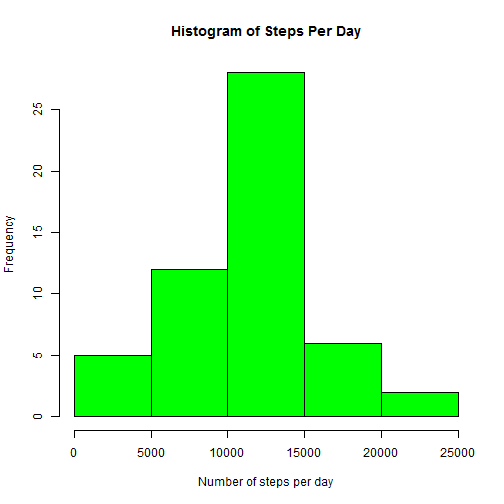
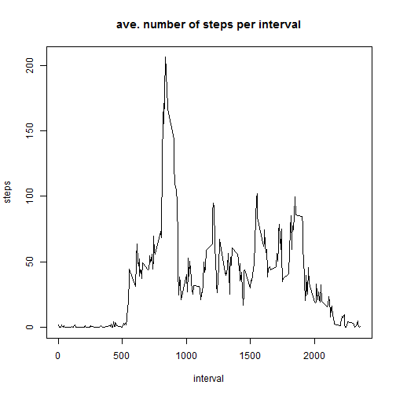
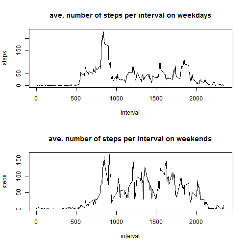

#Introduction

It is now possible to collect a large amount of data about personal movement using activity monitoring devices such as a Fitbit, Nike Fuelband, or Jawbone Up. These type of devices are part of the "quantified self" movement - a group of enthusiasts who take measurements about themselves regularly to improve their health, to find patterns in their behavior, or because they are tech geeks. But these data remain under-utilized both because the raw data are hard to obtain and there is a lack of statistical methods and software for processing and interpreting the data.

This assignment makes use of data from a personal activity monitoring device. This device collects data at 5 minute intervals through out the day. The data consists of two months of data from an anonymous individual collected during the months of October and November, 2012 and include the number of steps taken in 5 minute intervals each day

#Data

The variables included in this dataset are:

steps: Number of steps taking in a 5-minute interval (missing values are coded as NA)

date: The date on which the measurement was taken in YYYY-MM-DD format

interval: Identifier for the 5-minute interval in which measurement was taken

The dataset is stored in a comma-separated-value (CSV) file and there are a total of 17,568 observations in this dataset.

#Assignment Questions

##What is mean total number of steps taken per day?
###1. Calculate the total number of steps taken per day
Solution:
First read in the data


```r
stepData <- read.csv("repdata-data-activity/activity.csv")
```

One approach is to use tapply, apply the sum function to steps, grouped by date


```r
byDate <- tapply(stepData$steps, stepData$date, FUN=sum)
byDate
```

```
## 2012-10-01 2012-10-02 2012-10-03 2012-10-04 2012-10-05 2012-10-06 
##         NA        126      11352      12116      13294      15420 
## 2012-10-07 2012-10-08 2012-10-09 2012-10-10 2012-10-11 2012-10-12 
##      11015         NA      12811       9900      10304      17382 
## 2012-10-13 2012-10-14 2012-10-15 2012-10-16 2012-10-17 2012-10-18 
##      12426      15098      10139      15084      13452      10056 
## 2012-10-19 2012-10-20 2012-10-21 2012-10-22 2012-10-23 2012-10-24 
##      11829      10395       8821      13460       8918       8355 
## 2012-10-25 2012-10-26 2012-10-27 2012-10-28 2012-10-29 2012-10-30 
##       2492       6778      10119      11458       5018       9819 
## 2012-10-31 2012-11-01 2012-11-02 2012-11-03 2012-11-04 2012-11-05 
##      15414         NA      10600      10571         NA      10439 
## 2012-11-06 2012-11-07 2012-11-08 2012-11-09 2012-11-10 2012-11-11 
##       8334      12883       3219         NA         NA      12608 
## 2012-11-12 2012-11-13 2012-11-14 2012-11-15 2012-11-16 2012-11-17 
##      10765       7336         NA         41       5441      14339 
## 2012-11-18 2012-11-19 2012-11-20 2012-11-21 2012-11-22 2012-11-23 
##      15110       8841       4472      12787      20427      21194 
## 2012-11-24 2012-11-25 2012-11-26 2012-11-27 2012-11-28 2012-11-29 
##      14478      11834      11162      13646      10183       7047 
## 2012-11-30 
##         NA
```

###2. Make a histogram of the total number of steps taken each day
solution:
I can use the same list, byDate, which gives the sum of steps per day. with the histogram we see the frequency at which a certain range of steps per day occurs


```r
hist(byDate, col="green", main="Histogram of Steps Per Day", xlab="Number of steps per day")
```

 


###3. Calculate and report the mean and median of the total number of steps taken per day
Solution:
Simply apply summary to byDate


```r
summary(byDate)
```

```
##    Min. 1st Qu.  Median    Mean 3rd Qu.    Max.    NA's 
##      41    8841   10760   10770   13290   21190       8
```

This shows the median to be 10760 steps and the mean to be 10770 steps. Another way the find the mean is through a more direct approach. Then we can compare this value to the one given in the summary. 
Fisrt we clean the data set by removing NA values. Then we find the total number of steps and devide by the total number of days(that have data given). The summary(byDate) call showed 8 NAs, meaning 8 of the 61 days had no data.


```r
stepClean <- na.omit(stepData)
days <- unique(stepData$date)
stepsTot <- sum(stepClean$steps)
mean1 <- stepsTot/(length(days)-8)
mean1
```

```
## [1] 10766.19
```

As we can see the value of 10766.19 is comparable to 10770.

##What is the average daily activity pattern?
###1.Make a time series plot (i.e. type = "l") of the 5-minute interval (x-axis) and the average number of steps taken, averaged across all days (y-axis)

Solution:
To do this, we first use tapply, to apply mean to steps grouped by interval period. Then we build a data frame with 2 columns, one with the average number of steps and the other with corresponding daily time interval. The we can plot average number of steps vs. daily time interval


```r
byInterval <- tapply(stepClean$steps, stepClean$interval, FUN=mean)
mat1 <- matrix(unlist(byInterval))
intervals <- unique(stepData$interval)
mat2 <- matrix(unlist(intervals))
mat3 <- cbind(mat1[,1], mat2[,1])
df <- data.frame(mat3)
colnames(df) <- c("steps","interval")
plot(steps ~ interval, df, type ="l", main="ave. number of steps per interval")
```

 


###2. Which 5-minute interval, on average across all the days in the dataset, contains the maximum number of steps?

Solution:
To solve this, we create a simple 1 row 2 column matrix that locates the maximum number of average steps, and show the corresponding time interval


```r
df2 <- df[df$steps == max(df$steps),]
df2
```

```
##        steps interval
## 104 206.1698      835
```

So the interval from 8:30 a.m. to 8:35 a.m. has on average the highest number of steps at just over 206.

##Imputing missing values
There are a number of days/intervals where there are missing values (coded as NA). The presence of missing days may introduce bias into some calculations or summaries of the data.

###1. Calculate and report the total number of missing values in the dataset (i.e. the total number of rows with NAs)

Solution:
This is easy. The summary function gives the number of NAs


```r
summary(stepData)
```

```
##      steps                date          interval     
##  Min.   :  0.00   2012-10-01:  288   Min.   :   0.0  
##  1st Qu.:  0.00   2012-10-02:  288   1st Qu.: 588.8  
##  Median :  0.00   2012-10-03:  288   Median :1177.5  
##  Mean   : 37.38   2012-10-04:  288   Mean   :1177.5  
##  3rd Qu.: 12.00   2012-10-05:  288   3rd Qu.:1766.2  
##  Max.   :806.00   2012-10-06:  288   Max.   :2355.0  
##  NA's   :2304     (Other)   :15840
```

As we can see, NA's :2304

###2. Devise a strategy for filling in all of the missing values in the dataset. The strategy does not need to be sophisticated. For example, you could use the mean/median for that day, or the mean for that 5-minute interval, etc.
###3.Create a new dataset that is equal to the original dataset but with the missing data filled in.

Solution:
These 2 problems are essential one, as the following chunk of code does both. I use the mean for the 5 minute interval for the other days, then fill that into the the day with the NA value. Keep in mind from ealier analysis 8 0f the 61 days have NA values. I do this using a for loop for all the steps data, with a nested if statement that checks for NA values and replaces them if so.


```r
stepFilled <- stepData
for(i in 1:length(stepFilled$steps)){
  if(is.na(stepFilled[i, 1])==TRUE){
		stepInt <- stepFilled[i, 3]
		stepFilled[i, 1] <- df[df$interval==stepInt, 1]
	}
}
head(stepFilled)
```

```
##       steps       date interval
## 1 1.7169811 2012-10-01        0
## 2 0.3396226 2012-10-01        5
## 3 0.1320755 2012-10-01       10
## 4 0.1509434 2012-10-01       15
## 5 0.0754717 2012-10-01       20
## 6 2.0943396 2012-10-01       25
```

As you can see NA values are now filled with averages over the time intervals.

###4.Make a histogram of the total number of steps taken each day and Calculate and report the mean and median total number of steps taken per day. Do these values differ from the estimates from the first part of the assignment? What is the impact of imputing missing data on the estimates of the total daily number of steps?

Solution:
I use the same code as the first part of the assignment, only with the filled in data set


```r
byDate2 <- tapply(stepFilled$steps, stepFilled$date, FUN=sum)
summary(byDate2)
```

```
##    Min. 1st Qu.  Median    Mean 3rd Qu.    Max. 
##      41    9819   10770   10770   12810   21190
```

```r
hist(byDate, col="magenta", main="Histogram of Steps Per Day", xlab="Number of steps per day")
```

 

As you can see, the histogram is virtually identical, the mean is the same at 10770, and the median has changed slightly from 10760 to 10770

##Are there differences in activity patterns between weekdays and weekends?
 Use the dataset with the filled-in missing values for this part.
 
###1. Create a new factor variable in the dataset with two levels - "weekday" and "weekend" indicating whether a given date is a weekday or weekend day.

Solution:
First I created a new factor variable populate it randomly. Then i create a new column in the data set that tells the day of the week, and based on this information create yet another new column telling if it is a weekend or weekday


```r
poo <- sample(0:1, length(stepFilled$steps), replace=TRUE)
daytype <- factor(poo, labels=c("weekday","weekend"))
date <- as.Date(stepFilled$date)
weekday <- weekdays(date)
stepFilledExp <- cbind(stepFilled, weekday, daytype)
for(i in 1:length(stepFilledExp$steps)){
      if(stepFilledExp[i, 4]=="Saturday" | stepFilledExp[i, 4]=="Sunday"){
  	stepFilledExp[i, 5] <- "weekend"
	}
	else stepFilledExp[i,5] <- "weekday"
}
head(stepFilledExp)
```

```
##       steps       date interval weekday daytype
## 1 1.7169811 2012-10-01        0  Monday weekday
## 2 0.3396226 2012-10-01        5  Monday weekday
## 3 0.1320755 2012-10-01       10  Monday weekday
## 4 0.1509434 2012-10-01       15  Monday weekday
## 5 0.0754717 2012-10-01       20  Monday weekday
## 6 2.0943396 2012-10-01       25  Monday weekday
```

###2. Make a panel plot containing a time series plot (i.e. type = "l") of the 5-minute interval (x-axis) and the average number of steps taken, averaged across all weekday days or weekend days (y-axis). See the README file in the GitHub repository to see an example of what this plot should look like using simulated data.

Solution:
We first split the data frame into 2 parts, one for weekends and one for weekdays. We the run tapply to data frames to the steps per interval. Next we build a new df for both weekends and weekdays and the create the plots for each and compare


```r
weekDayDF <- stepFilledExp[stepFilledExp$daytype=="weekday",]
weekEndDF <- stepFilledExp[stepFilledExp$daytype=="weekend",]
byIntervalWD <- tapply(weekDayDF$steps, weekDayDF$interval, FUN=mean)
byIntervalWE <- tapply(weekEndDF$steps, weekEndDF$interval, FUN=mean)
matWD1 <- matrix(unlist(byIntervalWD))
matWE1 <- matrix(unlist(byIntervalWE))
intervalsWD <- unique(weekDayDF$interval)
intervalsWE <- unique(weekEndDF$interval)
matWD2 <- matrix(unlist(intervalsWD))
matWE2 <- matrix(unlist(intervalsWE))
matWD3 <- cbind(matWD1[,1], matWD2[,1])
matWE3 <- cbind(matWE1[,1], matWE2[,1])
dfWD <- data.frame(matWD3)
dfWE <- data.frame(matWE3)
colnames(dfWD) <- c("steps","interval")
colnames(dfWE) <- c("steps","interval")
par(mfrow=c(2,1))
plot(steps ~ interval, dfWD, type ="l", main="ave. number of steps per interval on weekdays")
plot(steps ~ interval, dfWE, type ="l", main="ave. number of steps per interval on weekends")
```

 
